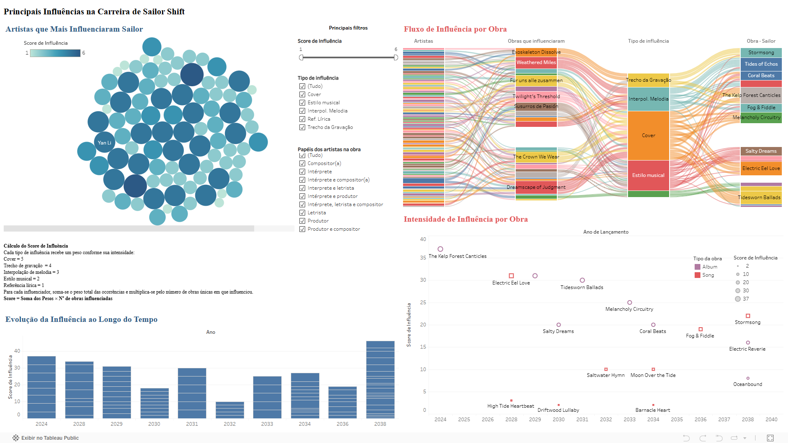
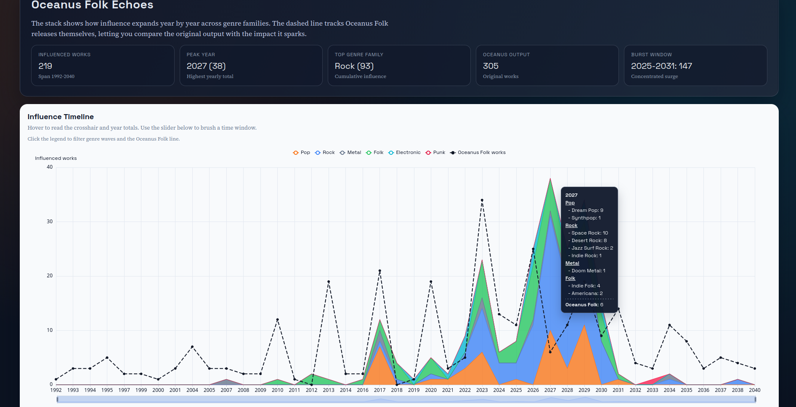
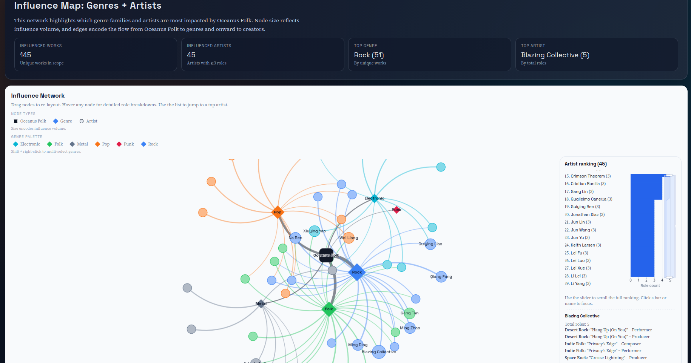
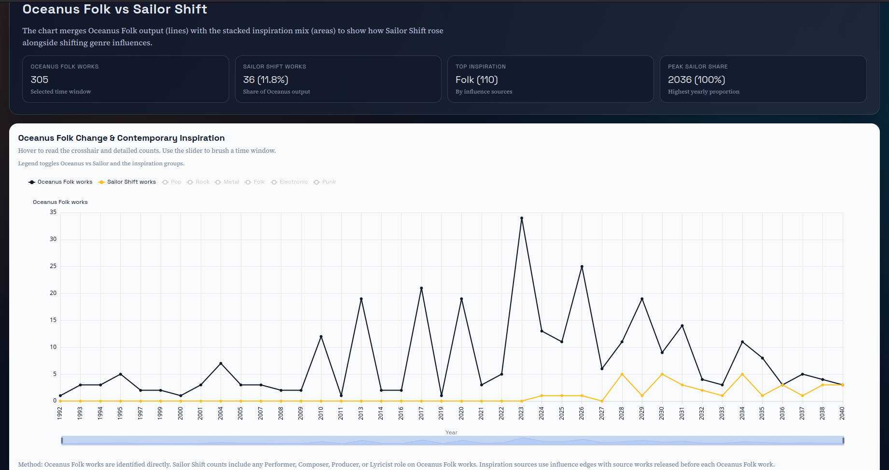
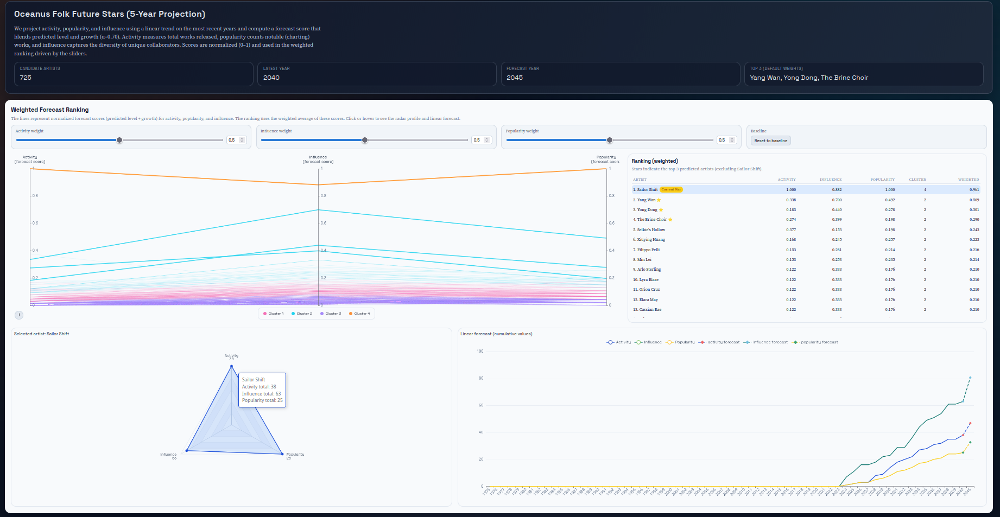

# 🌊✨ VAST Challenge 2025 – Mini‑Challenge 1

<p align="center">
  <font size="7">🌊</font> <font size="7">🎼</font> <font size="7">📊</font>
</p>

<p align="center">
  
  
  
  
  
  
  
  
</p>

**Contexto Geral**  
Sailor Shift é uma artista originária da ilha de Oceanus.  
Iniciou a carreira no gênero tradicional Oceanus Folk.  
Ganhou notoriedade global, ampliando o alcance do gênero.

**Marco de Carreira**  
Integrou a banda feminina Ivy Echoes em 2023.  
A banda se separou em 2026, iniciando carreiras solo.  
Em 2028, um single viralizou globalmente, marcando sua ascensão.

**Consolidação do Sucesso**  
Passou a lançar álbuns com frequência quase anual.  
Expandiu sonoridades para Indie Pop e Indie Folk.  
Ainda assim, manteve vínculo recorrente com Oceanus Folk.

**Impacto na Indústria**  
Tornou-se referência do gênero mundialmente.  
Impulsionou o turismo cultural em Oceanus.  
Incentivou novos artistas e colaborações.

**Rede de Influência**  
Ex‑integrantes da banda também cresceram na indústria.  
Contribuíram para a difusão do Oceanus Folk.  
Formaram uma nova geração de artistas do movimento.

**Problema Analítico**  
O jornalista Silas Reed deseja entender:  
A ascensão de Sailor.  
Suas influências.  
Seu impacto colaborativo.  
Para isso, foi criado um grafo de conhecimento musical a ser explorado visualmente.

**Acesso Rápido**  
- Respostas finais: `index.html`  
- Página pública: https://ojordany.github.io/vast-challenge-mini-challenge-1/  

**Estrutura do Projeto**
```text
.
├── MC1_graph.json
├── index.html
├── VAST Challenge 2025 C1 Answer Sheet.docx
├── requirements.txt
└── src
    ├── task1a
    │   └── images
    ├── task1b
    │   └── images
    ├── task1c
    │   └── images
    ├── task2a
    │   ├── task2a.html
    │   ├── task2a.json
    │   └── images
    ├── task2b
    │   ├── task2b.html
    │   ├── task2b.json
    │   └── images
    ├── task2c
    │   ├── task2c.html
    │   ├── task2c.json
    │   └── images
    ├── task3a
    │   └── images
    └── task3b
        ├── task3b.html
        ├── task3b.json
        └── images
```

**Stack e Ferramentas**  
- Python (pré‑processamento)  
- Pandas (manipulação de dados)  
- NumPy (cálculos)  
- Scikit‑learn (clusterização/score)  
- Apache ECharts (visualização interativa)  
- Tableau (dashboards interativos)  
- Jupyter Notebook / Colab (análise exploratória)

**Resumo por Tarefa (com visualizações)**

**Task 1(a) – Influenciadores de Sailor**  
Score de influência por tipo de relação e papéis criativos para identificar os principais influenciadores.  


**Task 1(b) – Colaborações diretas e indiretas**  
Rede de colaborações e influências, com ranking por intensidade de participação.  


**Task 1(c) – Impacto na comunidade Oceanus Folk**  
Evidências de notoriedade das obras associadas a Sailor e papéis criativos predominantes.  


**Task 2(a) – Influência ao longo do tempo**  
Áreas empilhadas mostram ondas de influência por família de gênero e linha pontilhada mostra Oceanus Folk original.  


**Task 2(b) – Gêneros e artistas mais influenciados**  
Rede Oceanus Folk → gêneros → artistas + ranking por papéis criativos.  


**Task 2(c) – Mudança do Oceanus Folk com Sailor**  
Inspirações empilhadas + linhas de Oceanus Folk e Sailor para mostrar concentração de autoria.  


**Task 3(a) – Perfil de estrela em ascensão**  
Comparação da evolução de atividade, influência e popularidade entre três artistas.  


**Task 3(b) – Previsão das próximas estrelas**  
Coordenadas Paralelas, ranking e projeção temporal para prever os próximos destaques do Oceanus Folk.  


**Como Reproduzir Localmente**  
- Instalar dependências: `pip install -r requirements.txt`  
- Regerar visualizações: `python src/task2a/build_task2a.py`  
- Regerar visualizações: `python src/task2b/build_task2b.py`  
- Regerar visualizações: `python src/task2c/build_task2c.py`  
- Regerar visualizações: `python src/task3b/build_task3b.py`

**Créditos**  
Trabalho desenvolvido para o VAST Challenge 2025 – Mini‑Challenge 1.
